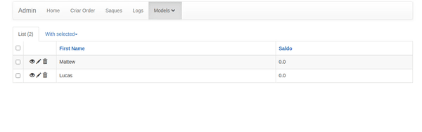

# ASM - ActionShowModal

English: Open modal with form when performing action

Pt-BR: Abrir modal com formulário ao realizar a ação





# Example of use
```python
from wtforms import HiddenField, IntegerField, Form
from flask_admin.contrib.sqla import ModelView
from wtforms.validators import InputRequired
from asm_modelview import ActionShowModal
from flask_admin.actions import action


class AddMoney(Form):
    value = IntegerField(validators=[InputRequired()])


class User(ModelView, ActionShowModal):
    list_template = 'admin/model/custom_list.html'

    @action('add_money', 'Adicionar Dinheiro', confirmation=None)
    def add_money(self, ids):

        return self.asm_create_action_modal(
            form=AddMoney,
            action_name='add_money',
            title_modal='Adicionar Dinheiro'
            )


    def asm_callback(self, action_name: str, ids: list):
        """
        Apply the desired action
        """
        
        if action_name == 'add_money':

            form = AddMoney(request.form)
            if form.validate():
                display_ids = ','.join(ids)
                flash(f'Valid form data! Callback IDS: {display_ids} | Callback Value: {form.value.data}', 'success')
            else:
                flash('Invalid form data!', 'info')

        else:
            flash('Invalid Action Name!', 'error')


```
